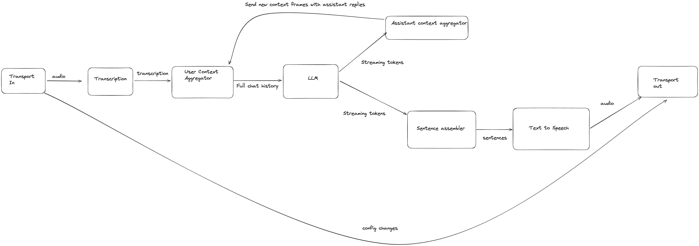

# simulflow - Real-time Data-Driven AI Pipeline Framework


> Daydreaming is the first awakening of what we call simulflow. It is
> an essential tool of rational thought. With it you can clear the mind for
> better thinking.
– Frank Herbert, _Heretics of Dune_


> Bene Gesserit also have the ability to practice simulflow, literally the
> simultaneous flow of several threads of consciousness at any given time; mental
> multitasking, as it were. The combination of simulflow with their analytical
> abilities and Other Memory is responsible for the frightening intelligence of
> the average Bene Gesserit.
Simulflow, [Dune Wiki](https://dune.fandom.com/wiki/Bene_Gesserit_Training#Simulflow)

[](https://clojars.org/com.shipclojure/simulflow)
<br>

**simulflow** is a Clojure framework for building real-time multimodal AI applications using a data-driven, functional approach. Built on top of `clojure.core.async.flow`, it provides a composable pipeline architecture for processing audio, text, video and AI interactions with built-in support for major AI providers.


> [!WARNING]
> While Simulflow has been used in live, production applications - it's still under *active* development.
> Expect breaking changes to support new usecases

## Installation

### Clojure CLI/deps.edn

```clojure
;; Add to your deps.edn
{:deps {com.shipclojure/simulflow {:mvn/version "0.1.5-alpha"}}}
```

### Leiningen/Boot

```clojure
;; Add to your project.clj
[com.shipclojure/simulflow "0.1.5-alpha"]
```

### Maven

```xml
<dependency>
  <groupId>com.shipclojure</groupId>
  <artifactId>simulflow</artifactId>
  <version>0.1.5-alpha</version>
</dependency>
```

## Requirements

- **Java 21+** - Required for virtual threads (Project Loom) support
- **Clojure 1.12+** - For core.async.flow and other modern Clojure features

## Video presentation:
[](https://youtu.be/HwoGMhIx5w0?t=345)

## Core Features

-   **Flow-Based Architecture:** Built on `core.async.flow` for robust concurrent processing
-   **Data-First Design:** Define AI pipelines as data structures for easy configuration and modification
-   **Streaming Architecture:** Efficient real-time audio and text processing
-   **Extensible:** Seamless to add new processors to embed into AI flows
-   **Flexible Frame System:** Type-safe message passing between pipeline components
-   **Built-in Services:** Ready-to-use integrations with major AI providers


## Quick Start: Local example

First, create a `resources/secrets.edn`:

```edn
{:deepgram {:api-key ""}
 :elevenlabs {:api-key ""
              :voice-id ""}
 :groq {:api-key ""}
 :openai {:new-api-sk ""}}
```

Obtain the API keys from the respective providers and fill in the blank values.

Start a REPL and evaluate the snippets in the `(comment ...)` blocks to start the flows.
Allow Microphone access when prompted.

```clojure
(ns simulflow-examples.local
  (:require
   [clojure.core.async :as a]
   [clojure.core.async.flow :as flow]
   [taoensso.telemere :as t]
   [simulflow.processors.deepgram :as asr]
   [simulflow.processors.elevenlabs :as tts]
   [simulflow.processors.llm-context-aggregator :as context]
   [simulflow.processors.openai :as llm]
   [simulflow.secrets :refer [secret]]
   [simulflow.transport :as transport]
   [simulflow.utils.core :as u]))

(defn make-local-flow
  "This example showcases a voice AI agent for the local computer.  Audio is
  usually encoded as PCM at 16kHz frequency (sample rate) and it is mono (1
  channel).
    "
  ([] (make-local-flow {}))
  ([{:keys [llm-context extra-procs extra-conns encoding debug?
            sample-rate language sample-size-bits channels chunk-duration-ms]
     :or {llm-context {:messages [{:role "system"
                                   :content "You are a helpful assistant "}]}
          encoding :pcm-signed
          sample-rate 16000
          sample-size-bits 16
          channels 1
          chunk-duration-ms 20
          language :en
          debug? false
          extra-procs {}
          extra-conns []}}]

   (flow/create-flow
     {:procs
      (u/deep-merge
        {;; Capture audio from microphone and send raw-audio-input frames further in the pipeline
         :transport-in {:proc transport/microphone-transport-in
                        :args {:audio-in/sample-rate sample-rate
                               :audio-in/channels channels
                               :audio-in/sample-size-bits sample-size-bits}}
         ;; raw-audio-input -> transcription frames
         :transcriptor {:proc asr/deepgram-processor
                        :args {:transcription/api-key (secret [:deepgram :api-key])
                               :transcription/interim-results? true
                               :transcription/punctuate? false
                               :transcription/vad-events? true
                               :transcription/smart-format? true
                               :transcription/model :nova-2
                               :transcription/utterance-end-ms 1000
                               :transcription/language language
                               :transcription/encoding encoding
                               :transcription/sample-rate sample-rate}}

         ;; user transcription & llm message frames -> llm-context frames
         ;; responsible for keeping the full conversation history
         :context-aggregator  {:proc context/context-aggregator
                               :args {:llm/context llm-context
                                      :aggregator/debug? debug?}}

         ;; Takes llm-context frames and produces new llm-text-chunk & llm-tool-call-chunk frames
         :llm {:proc llm/openai-llm-process
               :args {:openai/api-key (secret [:openai :new-api-sk])
                      :llm/model "gpt-4o-mini"}}

         ;; llm-text-chunk & llm-tool-call-chunk -> llm-context-messages-append frames
         :assistant-context-assembler {:proc context/assistant-context-assembler
                                       :args {:debug? debug?}}

         ;; llm-text-chunk -> sentence speak frames (faster for text to speech)
         :llm-sentence-assembler {:proc context/llm-sentence-assembler}

         ;; speak-frames -> audio-output-raw frames
         :tts {:proc tts/elevenlabs-tts-process
               :args {:elevenlabs/api-key (secret [:elevenlabs :api-key])
                      :elevenlabs/model-id "eleven_flash_v2_5"
                      :elevenlabs/voice-id (secret [:elevenlabs :voice-id])
                      :voice/stability 0.5
                      :voice/similarity-boost 0.8
                      :voice/use-speaker-boost? true
                      :flow/language language
                      :audio.out/encoding encoding
                      :audio.out/sample-rate sample-rate}}

         ;; audio-output-raw -> smaller audio-output-raw frames (used for sending audio in realtime)
         :audio-splitter {:proc transport/audio-splitter
                          :args {:audio.out/sample-rate sample-rate
                                 :audio.out/sample-size-bits sample-size-bits
                                 :audio.out/channels channels
                                 :audio.out/duration-ms chunk-duration-ms}}

         ;; speakers out
         :transport-out {:proc transport/realtime-speakers-out-processor
                         :args {:audio.out/sample-rate sample-rate
                                :audio.out/sample-size-bits sample-size-bits
                                :audio.out/channels channels
                                :audio.out/duration-ms chunk-duration-ms}}}
        extra-procs)
      :conns (concat
               [[[:transport-in :out] [:transcriptor :in]]

                [[:transcriptor :out] [:context-aggregator :in]]
                [[:context-aggregator :out] [:llm :in]]

                ;; Aggregate full context
                [[:llm :out] [:assistant-context-assembler :in]]
                [[:assistant-context-assembler :out] [:context-aggregator :in]]

                ;; Assemble sentence by sentence for fast speech
                [[:llm :out] [:llm-sentence-assembler :in]]
                [[:llm-sentence-assembler :out] [:tts :in]]

                [[:tts :out] [:audio-splitter :in]]
                [[:audio-splitter :out] [:transport-out :in]]]
               extra-conns)})))

(def local-ai (make-local-flow))

(comment

  ;; Start local ai flow - starts paused
  (let [{:keys [report-chan error-chan]} (flow/start local-ai)]
    (a/go-loop []
      (when-let [[msg c] (a/alts! [report-chan error-chan])]
        (when (map? msg)
          (t/log! {:level :debug :id (if (= c error-chan) :error :report)} msg))
        (recur))))

  ;; Resume local ai -> you can now speak with the AI
  (flow/resume local-ai)

  ;; Stop the conversation
  (flow/stop local-ai)

  ,)
```

Which roughly translates to:




See [examples](./examples/src/voice_fn_examples/) for more usages.


## Supported Providers


### Text-to-Speech (TTS)

-   **ElevenLabs**
    -   Models: `eleven_multilingual_v2`, `eleven_turbo_v2`, `eleven_flash_v2` and more.
    -   Features: Real-time streaming, multiple voices, multilingual support


### Speech-to-Text (STT)

-   **Deepgram**
    -   Models: `nova-2`, `nova-2-general`, `nova-2-meeting` and more.
    -   Features: Real-time transcription, punctuation, smart formatting


### Text Based Large Language Models (LLM)

-   **OpenAI**
    -   Models: `gpt-4o-mini`(fastest, cheapest),  `gpt-4`, `gpt-3.5-turbo` and more
    -   Features: Function calling, streaming responses
-   **Google**
    -   Models: `gemini-2.0-flash`(fastest, cheapest),  `gemini-2.5-flash`,  and more
    -   Features: Function calling, streaming responses, thinking
-   **Groq**
    -   Models: `llama-3.2-3b-preview` `llama-3.1-8b-instant` `llama-3.3-70b-versatile` etc
    -   Features: Function calling, streaming responses, thinking


## Key Concepts

### Flows

The core building block of simulflow pipelines:

-   Composed of processes connected by channels
-   Processes can be:
    -   Input/output handlers
    -   AI service integrations
    -   Data transformers
-   Managed by `core.async.flow` for lifecycle control

### Transport

The modality through which audio comes and goes from the voice ai pipeline. Example transport modalities:

- local (microphone + speakers)
- telephony (twilio through websocket)
- webRTC (browser support) - TODO
- async (through in & out core async channels)

You will see processors like `:transport-in` & `:transport-out`

### Frames

The basic unit of data flow, representing typed messages like:

-   `:simulflow.frame/audio-input-raw` - Raw audio data from input transport
-   `:simulflow.frame/transcription-result` - Transcribed text from speech-to-text
-   `:simulflow.frame/llm-text-chunk` - LLM response text chunks
-   `:simulflow.frame/llm-tool-call-chunk` - LLM tool call request chunks
-   `:simulflow.frame/audio-output-raw` - Raw audio data for playback
-   `:simulflow.frame/speak-frame` - Text for TTS processing
-   `:simulflow.frame/user-speech-start`, `:simulflow.frame/user-speech-stop` - User speech events
-   `:simulflow.frame/bot-speech-start`, `:simulflow.frame/bot-speech-stop` - Bot speech events
-   `:simulflow.frame/system-start`, `:simulflow.frame/system-stop` - System control signals

Each frame has a type and optionally a schema for the data contained in it.

#### Frame Schema Validation (Development Only)

For development and debugging, you can enable frame schema validation to catch invalid frame data early. This should **only be used during development** as it adds runtime overhead:

```bash
# Enable frame schema checking via JVM property
clojure -J-Dsimulflow.frame.schema-checking=true -M:dev your-namespace

# Or add to your deps.edn :dev alias
{:aliases
 {:dev {:jvm-opts ["-Dsimulflow.frame.schema-checking=true"]
        ...}}}
```

When enabled, creating frames with invalid data will throw exceptions with detailed error messages:

```clojure
;; This will throw if schema checking is enabled and data is invalid
(frame/audio-input-raw "invalid-data") ; Should be byte array
;; => ex-info "Invalid frame data" {...}
```

**Warning**: Never enable schema checking in production as it significantly impacts performance.

See [frame.clj](./src/simulflow/frame.clj) for all possible frames.


### Processes

Components that transform frames:

-   Define input/output requirements
-   Can maintain state
-   Use core.async for async processing
-   Implement the `flow/process` protocol


## Adding Custom Processes

```clojure
    (defn custom-processor []
      (flow/process
        {:describe (fn [] {:ins {:in "Input channel"}
                           :outs {:out "Output channel"}})
         :init identity
         :transform (fn [state in msg]
                      [state {:out [(process-message msg)]}])}))
```


Read core.async.flow docs for more information about flow precesses.

## Modular Processor Functions

Simulflow processors are designed for modularity and reuse. Each processor can expose its core functionality as multi-arity functions that can be used independently or composed into custom processors.

### Multi-Arity Function Pattern

Processors follow a standard multi-arity pattern that maps directly to `core.async.flow` lifecycle:

```clojure
(defn processor-fn
  ([] {:ins {:in "Description"} :outs {:out "Description"} :params {...}})  ; 0-arity: describe
  ([config] {...})                                                          ; 1-arity: init
  ([state transition] {...})                                                ; 2-arity: transition
  ([state input-port data] [state {...}]))                                  ; 3-arity: transform
```

### Example: Reusing Transport Functions

Here's how you can reuse transport processor functions in your own custom processors:

```clojure
(ns my-cool-processor
  (:require [simulflow.transport :as transport]
            [simulflow.frame :as frame]
            [simulflow.utils.audio :as audio]))

(defn mic-transport-fn
  "Custom microphone transport with audio processing"
  ([] (transport/mic-transport-in-describe))
  ([params] (transport/mic-transport-in-init! params))
  ([state transition]
   (transport/mic-transport-in-transition state transition))

  ;; Custom transform with audio processing
  ([state _ {:keys [audio-data timestamp]}]
   (let [processed-audio (audio/apply-noise-reduction audio-data)
         float-audio (PCMConverter/convertToFloat32Buffer processed-audio)]
     [state {:out [(frame/audio-input-raw float-audio {:timestamp timestamp})]}])))

;; Use in a flow
(def my-flow
  (flow/create-flow
    {:procs {:custom-mic {:proc (flow/process mic-transport-fn)
                          :args {:audio-in/sample-rate 16000}}}
     :conns [[:custom-mic :out] [:next-processor :in]]}))
```

### Composing Processor Logic

You can also compose transform logic from multiple processors:

```clojure
(defn hybrid-processor-fn
  ([] {:ins {:in "Mixed input"} :outs {:out "Processed output"}})
  ([params] {:config params})
  ([state transition] (when (= transition :stop) (cleanup state)))

  ([state input-port data]
   (cond
     ;; Handle audio using transport transform
     (frame/audio-input-raw? data)
     (transport/mic-transport-transform state input-port data)

     ;; Handle text using LLM transform
     (frame/llm-context? data)
     (openai/transform state input-port data)

     ;; Custom handling for other frames
     :else
     [state {:out [(custom-transform data)]}])))
```

### Benefits of Modular Functions

- **Reusability**: Use processor logic across different flows
- **Testability**: Test individual transform functions in isolation
- **Composability**: Mix and match functionality from different processors
- **Customization**: Override specific behaviors while reusing core logic
- **Debugging**: Easier to debug individual components

This pattern enables building complex AI pipelines by composing smaller, well-tested components while maintaining the data-driven architecture that makes simulflow powerful.


## Built With

-   [core.async](<https://github.com/clojure/core.async>) - Concurrent processing
-   [core.async.flow](<https://clojure.github.io/core.async/#clojure.core.async.flow>) - Flow control
-   [Hato](<https://github.com/gnarroway/hato>) - WebSocket support
-   [Malli](<https://github.com/metosin/malli>) - Schema validation


## Acknowledgements

Voice-fn takes heavy inspiration from [pipecat](https://github.com/pipecat-ai/pipecat). Differences:
- simulflow uses a graph instead of a bidirectional queue for frame transport
- simulflow has a data centric implementation. The processors in simulflow are
  pure functions in the `core.async.flow` transform syntax

## License

MIT
